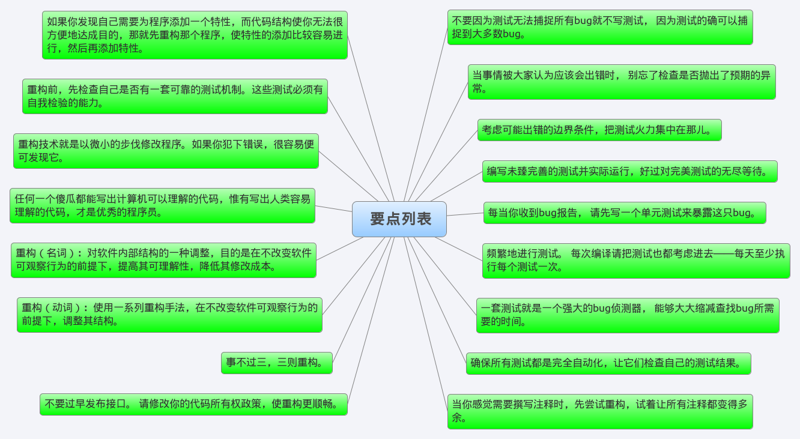
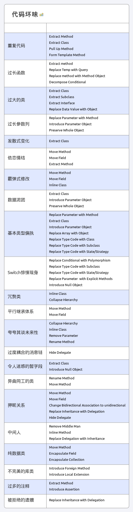

# 重构

- 重复代码(Duplicated Code)
    - 同一个类的两个函数含有相同表达式
    ```
    Extract Method
    ```
    - 两个互为兄弟的子类内含有相同表达式
    ```
    From Template Method
    Pull up Method
    ```
    - 不相关的类出现Duplicated code
    ```
    Extract Class
    ```
- 过长函数(Long Method)
    - Extract Method
    - 查询取代临时变量(replace temp with query)
    ```
    动机: 临时变量是暂时的，只能在所属函数内使用，由于临时变量只在所属函数内可见，所以它会驱使你写出更长的函数，因为这样你才能访问到需要的临时变量
    ```
    ```c++
    double basePrice=_quantity*itemPrice;
    if(basePrice>1000) return basePrice*0.95;
    else return basePrice*0.98;
 
    // 范例：重构以后
    double getBasePrice()
    {
	    return _quantity*itemPrice;
    }

    if(getBasePrice()>1000) return getBasePrice()*0.95；
    else return getBasePrice()*0.98;
    ```
    - 引入参数对象(Introduce Parameter Object)
    ```
    动机: 你常会看到特定的一组参数总是一起被传递。可能有好几个函数都使用了这一组参数，这些函数可能率属于同一个类，也可能率属于不同的类，这样一组参数就是所谓的的 Data Clumps(数据泥团),我们可以用一个对象包装所有的这些数据，再以该对象取代它们
    ```
    ```c++
    struct A
    {
        void add(int a, int b){}
        void div(int a, int b){}
    }

    struct Data
    {
        int a;
        int b;
        int GetA() { return a; }
        int GetB() { return b; }
    }
    ```

    - 保持对象完整(preserve whole object)
    ```
    动机: 有时候传递对象的一些参数，无法应对修改变化，还不如传递整个对象
    ```
    - 以函数对象取代函数(replace Method with Method object)
    ```
    动机: 局部变量无法拆解成为一个函数，这时你应该把这些局部变量，变成对象的字段，然后再抽取成为函数
    ```
    ```c++
    struct Account
    {
        void caclc(int a, int b, int c)
        {
            // 计算
        }
    };

    struct CaclcData
    {
        int a;
        int b;
        int c;

        CaclcData(int _a, int _b, int _c) : a(_a), b(_b), c(_c){}
        void compute()
        {
            // 计算
        }

    };

    struct AccountB
    {
        void caclc(int a, int b, int c)
        {
            return CaclcData(a, b, c).compute();
        }
    };
    ```
    - 分解条件表达式(Decompose Conditional)
- 过大的类(Large Class)


<https://www.cnblogs.com/angeldevil/p/3601730.html)>  


